# 🌤️ Cloudzy – Scalable Microservices Weather & Pricing Platform

This is a solution to the following task: 

Build three back-end services—a **Weather** Service, a **Pricing** Service, and an **API Gateway**—and wire them together in a production-grade, containerized microservices architecture.

- **Service 1: Weather Service**  
  Fetches the status of an object from an external (and potentially unstable) HTTP API, applies retry logic and exponential backoff on failure, handles errors gracefully, and stores the latest real-time status in Redis for downstream consumers.

- **Service 2: Pricing Service**  
  Subscribes every second to the **Weather** Service’s updated status, retrieves distance, altitude and temperature parameters, and calculates a dynamic fuel-cost metric in real time. Results are pushed back into Redis so that clients can retrieve fresh pricing data without overloading the backend.

- **Service 3: API Gateway**  
  Exposes a REST/gRPC facade that unifies Weather and Pricing endpoints, handles authorization and input validation, performs caching via Redis to reduce repeated upstream calls, and logs all requests with structured zerolog output.

Each service is written in Go using clean-architecture principles, communicates over gRPC and Protobuf, and is dockerized with health checks and retry middleware. A top-level Makefile and per-service Docker Compose files streamline code generation, builds, and deployment.

```mermaid
flowchart LR
subgraph External API
E[Unstable Third-party API]
end

subgraph WeatherService
WS1["grpc-server<br/>Fetch status from External API"]
WS2["weather-worker<br/>Retry & Exponential Backoff"]
WS3["Publish latest status to Redis"]
WR[(Redis)]
end

subgraph PricingService
PS1["grpc-server"]
PS2["pricing-worker<br/>Compute fuel cost every second after call Weather service"]
PS3["Publish pricing data to Redis"]
PR[(Redis)]
end

subgraph APIGateway
GW1["gRPC / REST endpoints"]
end

%% Client connection
Client["👤 Client"] -->|API Calls| GW1
GW1 -->|Responses| Client

%% Existing connections
E -->|HTTP request| WS1
WS1 --> WS2
WS2 --> WS3
WS3 --> WR
PS1 --> PS2
PS2 --> PS3
PS3 --> PR
GW1 -->|gRPC| WS1
GW1 -->|gRPC| PS1

WR --> WS1
PR --> PS1
```



---

## 🚀 Features

- **Clean Architecture** – Separate layers for domain, service logic, and delivery to maximize testability and clarity  
- **High-Performance gRPC** – Protobuf-based RPC with retry interceptors and backoff policies  
- **Real-Time Processing** – Pricing calculations run every second against live weather data  
- **Redis Caching & Pub/Sub** – Centralized in-memory store for sharing state and reducing external calls  
- **Modular & Extensible** – Independently deployable services that can be extended or replaced  
- **Dockerized with Healthchecks** – Container images, Compose files, and readiness probes for production readiness  
- **Workflow Automation** – Makefile targets for proto generation, builds, up/down, and logs

---

## 📁 Project Structure

```
cloudzy/
├── gateway/        # Entrypoint gateway service (API aggregator)
├── pricing/        # Pricing microservice
├── weather/        # Weather microservice
├── proto/          # Shared Protobuf definitions + generated code
├── Makefile        # CLI build and proto tools
└── docker-compose.yml
```

## 🛠️ Getting Started

### 📦 Prerequisites

- Docker & Docker Compose
- `protoc` and `protoc-gen-go` / `protoc-gen-go-grpc`

### 🔧 Build & Run Locally

```bash
# Generate gRPC code from proto
make generate

cd weather/deploy
# Start all services with Docker Compose
docker-compose up -d

cd ../../
cd pricing/deoploy

docker-compose up -d

cd weather
# first of all run weather server other services depends on it
go run cmd/main.go grpc-server
# in other terminal
go run cmd/main.go weather-worker
```

Pricing service
```
cd pricing
go run cmd/main.go grpc-server

# in other terminal
go run cmd/main.go pricing-worker
```
Gateway service
```
cd gateway
go run cmd/main.go server

# call apis
curl localhost:8000/api/fuel-price
curl localhost:8000/api/weather-status
```
todo: dockerize all of these